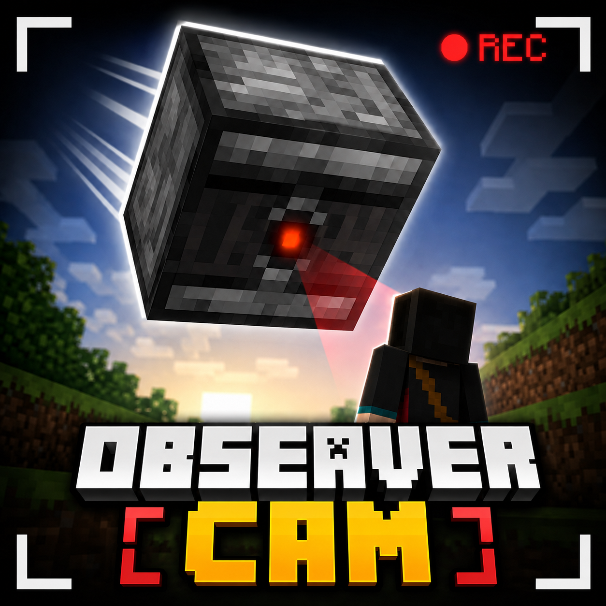

# Observer Cam



Observer Cam is a Fabric mod that adds an autonomous, floating Observer-block cameraman. The visible Observer is the camera: its observing face supplies the exact position, yaw, and pitch used by Observer POV. An optional talkative-assistant layer can give that camera character a small amount of client-local personality.

The current build is a **public-beta candidate**. Core camera movement, Observer POV, recording, instant replay, and PiP are implemented; the remaining work is the final multi-scenario gameplay acceptance pass described in [Release readiness](docs/RELEASE.md).

## Requirements

- Minecraft Java Edition **1.21.11**
- Fabric Loader **0.18.4 or newer**
- Fabric API **0.141.2+1.21.11 or newer for Minecraft 1.21.11**
- Java **21**
- Mod Menu 17.x (optional, for the settings button)
- [FFmpeg](https://ffmpeg.org/download.html) (required only for video recording; Observer Cam detects the standard Winget package or you can select `ffmpeg.exe` in Recording settings)

The movement authority lives on the server, so multiplayer servers must install Observer Cam and Fabric API. Clients need the mod to render the entity and use Observer POV.

## Installation

1. Install Fabric Loader 0.18.4 for Minecraft 1.21.11.
2. Put a Minecraft 1.21.11-compatible Fabric API version (0.141.2 or newer) and the Observer Cam jar in the instance's `mods` folder.
3. For multiplayer, install the same two jars on the server. Mod Menu is client-only and optional.
4. Launch the game, open **Mods → Observer Cam → Configure**, and switch **Cameraman enabled** on.

FFmpeg is not needed for the cameraman, Observer POV, or PiP. Install or select it only when you want to record video or use instant replay.

## Commands and controls

- `/observercam summon` — creates an Observer, targeting the executing player.
- `/observercam target <player>` — assigns your Observer to film a selected player.
- `/observercam follow` — targets the executing player and starts following; summons an Observer if needed.
- `/observercam dismiss` — removes your Observer.
- `/observercam view` — toggles the executing player's Observer POV.
- Every Observer Cam shortcut is unbound by default so the mod cannot take a key used by Minecraft or another mod. Assign only the controls you want under **Options → Controls → Key Binds → Observer Cam**.
- Cameraman, Observer POV, recording, PiP, and instant-replay save actions remain available from Observer Cam's Mod Menu screens without assigning any shortcut.

With Mod Menu installed, open **Mods → Observer Cam → Configure**. The landing page puts **Cameraman enabled**, **Enter/Exit Observer POV**, **Start/Stop recording**, and **Show/Hide Observer PiP** at the top. Switching the cameraman off dismisses your Observers and restores normal POV. The preference is applied again when you join a world. Commands remain available as testing and administration alternatives.

If the viewed Observer is removed, unloaded, changes dimension, or the connection closes, the camera safely returns to the real player. Player input remains attached to the player while Observer POV is active.

## Cameraman behavior

The director plans a shot every four game ticks and moves every tick. It generates 18 positions around the predicted player location and considers:

- four-point player visibility (head through legs), with limited leaf tolerance;
- one-block camera clearance and direct path obstruction;
- adaptive indoor/outdoor distance and height;
- projected player screen size for the configured FOV;
- five inexpensive background-depth rays;
- continuity, minimum shot duration, and a side-switch threshold.

Documentary framing uses a soft central zone instead of pinning the player to the exact center pixel. Small footsteps and jumps are absorbed before the camera responds, movement direction creates natural lead room, and shot headings turn gradually. Usable angles are held for several seconds; a comparable alternate view is introduced only occasionally. Up to four nearby visible players or mobs can gently widen and bias the composition while the tracked player remains the dominant subject.

Normal movement is acceleration- and speed-limited. The Observer checks its full body-width flight path, detects stalled motion, and uses a clear visible recovery position only after a blocked route, large teleport, or unrecoverable separation.

## Configuration

Open **Mods → Observer Cam → Configure** when Mod Menu is installed. Quick cameraman, POV, recording, and PiP actions appear first; Camera, Movement, Auto Director, Assistant, Recording, Video Output, PiP, Instant Replay, and Diagnostics use a compact category grid below them. Settings are saved to `config/observercam.json` and applied live when safe. Camera behavior settings are validated and synchronized as a per-player snapshot, so one player's preferences cannot overwrite another player's director on a dedicated server. Hover any control for a plain-language explanation; numeric settings display their units, and **Reset Defaults** asks for confirmation before replacing the configuration.

The **Recording** page chooses and opens the output folder, selects an FFmpeg executable, optionally selects a Windows game-audio loopback source, and controls the total storage cap. **Video Output** selects MP4/H.264, MKV/H.264, or WebM/VP9; Current Window, 720p, 1080p, 1440p, or 4K output; High, Balanced, or Smaller Files compression; 15–120 FPS; and HUD inclusion. Fixed resolutions preserve the captured aspect ratio and use black bars only when required. An empty output setting resolves to `observercam/recordings` inside the current game directory. The combined folder budget defaults to **3 GB** and is checked throughout each recording; Observer Cam stops safely before crossing the limit and never deletes completed videos. Clean recordings are finalized from a `.partial` name, while failed sessions retain a small diagnostic log. Recording can use a clean background Observer render while the player continues using their normal view.

**Instant Replay** is off by default. When enabled, it starts buffering automatically while the Observer is available—whether the player uses normal view or Observer POV—and retains only the latest configured time or size. Use **Save recent footage** in Mod Menu or assign its optional shortcut to turn the retained two-second segments into a normal video; buffering resumes automatically afterward. Its hidden temporary directory is private to Observer Cam, and eviction never touches completed videos or unrelated files. Starting a normal recording briefly pauses and discards the rolling buffer so two encoders do not compete for the GPU/CPU. See the [recording plan](docs/RECORDING_PLAN.md) for implementation and safety details.

**Observer picture-in-picture** is off by default. It renders a bounded live feed from the Observer in the upper-left corner while the normal player camera remains active. Small, Medium, and Big window presets are available, with Big preserving the original size. Render resolution, 2–60 FPS refresh rate, and 25–100% opacity are configured separately; Balanced at 5 FPS and 100% opacity are the defaults. The preview uses a compact one-pixel frame and hides automatically in full Observer POV and when Minecraft's HUD is hidden. Because it performs a second world render for each preview update, leave it off when maximum shader performance is more important than monitoring the shot.

**Talkative assistant** is off by default. When enabled, the player's own Observer can show one of three short, wall-occluded fact captions above itself and optionally copy the full fact to local chat or read it with Minecraft's bundled narrator voice. **Say cool facts** can be disabled independently, and **Fact interval** controls a one-to-five-minute active-gameplay delay that pauses in menus. Speech is opt-in, non-spatial, uses the Voice volume slider, and requires no additional installation. Facts and settings are never sent to the server or other players.

Game audio is optional and off by default. When Windows already provides a loopback source such as **Stereo Mix**, choose it under **Recording → Audio source**, then enable **Record audio**. Audio and video share one FFmpeg process and timeline; MP4/MKV use AAC and WebM uses Opus, including instant-replay segments. Observer Cam does not install an audio driver, replace Minecraft's OpenAL context, or show microphones in its game-audio picker. If Windows exposes no loopback source, recording remains video-only.

The debug HUD reports the current director state, distance, target, visibility, score, indoor estimate, speed, and candidate count. Debug candidate/raycast visualization uses colored particles:

- green — selected position;
- white — valid candidate;
- red — blocked candidate;
- orange — weak visibility;
- cyan — selected camera-to-focus ray.

## Known limitations

- This beta is intentionally pinned to Minecraft 1.21.11 and the tested Fabric API build.
- Video export requires a separate FFmpeg installation. Observer Cam does not bundle or download it.
- Automatic game-audio source selection is Windows-only and uses an already available loopback source. No audio driver is installed, and video-only recording remains the default.
- PiP and background capture perform a second world render at their configured rate, so demanding resolutions, frame rates, and shader packs can make them expensive.
- ReplayMod and Flashback camera-track integration is not implemented or advertised as compatible yet.

## Build and run

```powershell
.\gradlew.bat build
.\gradlew.bat runClient
```

The distributable jar is written to `build/libs/observercam-0.1.0-beta.1+mc1.21.11.jar`.

The supplied artwork is packaged as an optimized in-game/Mod Menu icon at `src/client/resources/assets/observercam/icon.png`. Before reusing any artwork on a public project page, confirm its distribution rights, provenance, and the host's current media policy.

See [Release readiness](docs/RELEASE.md) for the remaining publication gate, [Testing](docs/TESTING.md) for the hands-on pass, [Changelog](CHANGELOG.md) for release notes, [Architecture](docs/ARCHITECTURE.md) for implementation details, [Recording plan](docs/RECORDING_PLAN.md) for the video roadmap, and [Research](docs/RESEARCH.md) for source-review notes.
